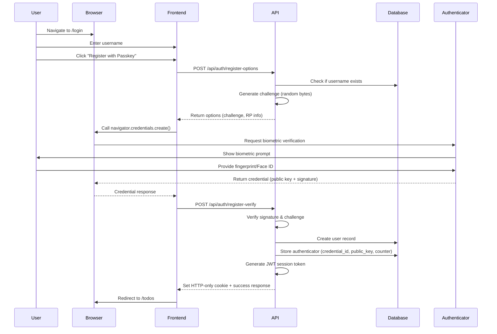
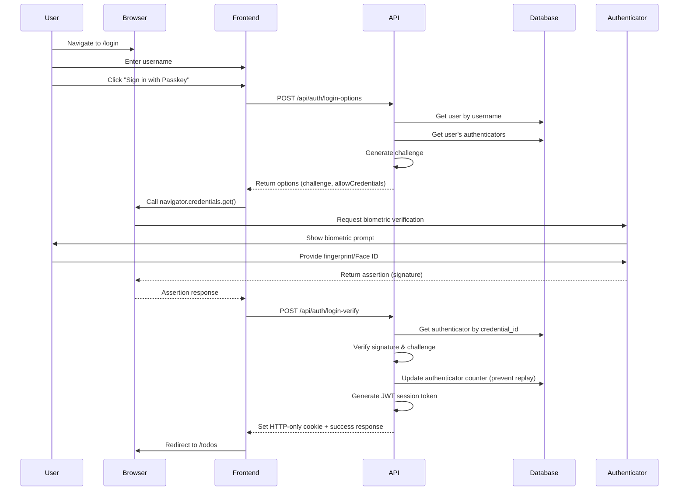

# PRP-11: WebAuthn/Passkeys Authentication

## Feature Overview

Implement passwordless authentication using WebAuthn (Web Authentication API) and Passkeys, enabling users to securely register and login using biometric authentication (fingerprint, Face ID, Touch ID) or hardware security keys. The system uses JWT-based session management with HTTP-only cookies and middleware-based route protection.

**Key Benefits:**
- **Enhanced Security**: No passwords to steal, phish, or leak
- **Better UX**: Faster login with biometrics (no typing required)
- **Modern Standard**: W3C WebAuthn standard with wide browser support
- **Privacy-First**: Biometric data never leaves the user's device
- **Multi-Device**: Users can register multiple authenticators

## User Stories

### Primary Users

**1. New User (First-Time Registration)**
- As a new user, I want to register with just my username and biometrics
- So that I can quickly create an account without remembering a password
- And access my todos securely from any device with passkey support

**2. Returning User (Login)**
- As a returning user, I want to login using my fingerprint or Face ID
- So that I can access my todos in under 2 seconds
- Without typing any credentials

**3. Multi-Device User**
- As a user with multiple devices, I want to register separate passkeys per device
- So that I can login from my laptop, phone, and tablet
- Each with their own biometric authentication

**4. Security-Conscious User**
- As a security-conscious user, I want hardware security key support (YubiKey)
- So that I can use professional-grade authentication
- Even on shared or untrusted computers

### Secondary Users

**5. System Administrator**
- As a system admin, I need secure session management with automatic expiry
- So that abandoned sessions don't pose security risks
- And users are prompted to re-authenticate after 7 days

## User Flow

### Registration Flow (New User)



### Login Flow (Returning User)



### Session Management Flow

```
User Visits Protected Route (/todos)
    ↓
Middleware Intercepts Request
    ↓
Check for Session Cookie
    ↓
Valid JWT? → Yes → Allow Access
    ↓
Expired/Invalid? → No → Redirect to /login
```

## Technical Requirements

### Database Schema

#### Users Table
```sql
CREATE TABLE users (
  id INTEGER PRIMARY KEY AUTOINCREMENT,
  username TEXT NOT NULL UNIQUE,
  created_at TEXT NOT NULL DEFAULT (datetime('now'))
);

CREATE INDEX idx_users_username ON users(username);
```

#### Authenticators Table
```sql
CREATE TABLE authenticators (
  id INTEGER PRIMARY KEY AUTOINCREMENT,
  user_id INTEGER NOT NULL,
  credential_id TEXT NOT NULL UNIQUE,  -- base64url encoded
  public_key TEXT NOT NULL,            -- base64url encoded
  counter INTEGER NOT NULL DEFAULT 0,   -- Prevents replay attacks
  transports TEXT,                      -- JSON array: ["usb", "nfc", "ble", "internal"]
  device_name TEXT,                     -- Optional: "MacBook Pro Touch ID"
  created_at TEXT NOT NULL DEFAULT (datetime('now')),
  last_used_at TEXT,
  FOREIGN KEY (user_id) REFERENCES users(id) ON DELETE CASCADE
);

CREATE INDEX idx_authenticators_user_id ON authenticators(user_id);
CREATE INDEX idx_authenticators_credential_id ON authenticators(credential_id);
```

### TypeScript Interfaces

```typescript
// lib/db.ts
export interface User {
  id: number;
  username: string;
  created_at: string;
}

export interface Authenticator {
  id: number;
  user_id: number;
  credential_id: string;
  public_key: string;
  counter: number;
  transports: string | null;
  device_name: string | null;
  created_at: string;
  last_used_at: string | null;
}

export interface AuthenticatorInput {
  user_id: number;
  credential_id: string;
  public_key: string;
  counter: number;
  transports?: string[];
  device_name?: string;
}

// lib/auth.ts
export interface Session {
  userId: number;
  username: string;
}

export interface JWTPayload extends Session {
  iat: number;  // Issued at
  exp: number;  // Expiry
}
```

### API Endpoints

#### 1. POST /api/auth/register-options
**Purpose**: Generate registration challenge for new user

**Request Body**:
```typescript
{
  username: string;  // 3-50 characters, alphanumeric + underscore/dash
}
```

**Response** (200):
```typescript
{
  options: PublicKeyCredentialCreationOptions {
    challenge: string;              // base64url random bytes (32+)
    rp: {
      name: "Todo App";
      id: "localhost" | "yourdomain.com";  // No protocol/port
    };
    user: {
      id: string;                   // base64url encoded user ID
      name: string;                 // username
      displayName: string;          // username (can be different)
    };
    pubKeyCredParams: [
      { alg: -7, type: "public-key" },   // ES256
      { alg: -257, type: "public-key" }  // RS256
    ];
    timeout: 60000;                 // 60 seconds
    attestation: "none";            // Privacy-friendly
    authenticatorSelection: {
      authenticatorAttachment: "platform";  // Prefer platform authenticators
      requireResidentKey: false;
      userVerification: "preferred";
    };
  }
}
```

**Error Responses**:
- 400: `{ error: "Username is required" }`
- 400: `{ error: "Username must be 3-50 characters" }`
- 409: `{ error: "Username already exists" }`
- 500: `{ error: "Failed to generate registration options" }`

---

#### 2. POST /api/auth/register-verify
**Purpose**: Verify registration response and create user + authenticator

**Request Body**:
```typescript
{
  username: string;
  credential: RegistrationResponseJSON;  // From @simplewebauthn/browser
}
```

**Response** (200):
```typescript
{
  success: true;
  username: string;
  userId: number;
}
// + Sets HTTP-only session cookie
```

**Error Responses**:
- 400: `{ error: "Username and credential are required" }`
- 409: `{ error: "Username already registered" }`
- 400: `{ error: "Invalid registration response" }` (signature verification failed)
- 500: `{ error: "Registration failed" }`

---

#### 3. POST /api/auth/login-options
**Purpose**: Generate authentication challenge for existing user

**Request Body**:
```typescript
{
  username: string;
}
```

**Response** (200):
```typescript
{
  options: PublicKeyCredentialRequestOptions {
    challenge: string;              // base64url random bytes
    timeout: 60000;
    rpId: "localhost" | "yourdomain.com";
    allowCredentials: [              // User's registered authenticators
      {
        id: string;                 // credential_id (base64url)
        type: "public-key";
        transports: ["internal", "usb", ...];
      }
    ];
    userVerification: "preferred";
  }
}
```

**Error Responses**:
- 400: `{ error: "Username is required" }`
- 404: `{ error: "User not found" }`
- 404: `{ error: "No authenticators registered" }`
- 500: `{ error: "Failed to generate login options" }`

---

#### 4. POST /api/auth/login-verify
**Purpose**: Verify authentication response and create session

**Request Body**:
```typescript
{
  username: string;
  credential: AuthenticationResponseJSON;  // From @simplewebauthn/browser
}
```

**Response** (200):
```typescript
{
  success: true;
  username: string;
  userId: number;
}
// + Sets HTTP-only session cookie
```

**Error Responses**:
- 400: `{ error: "Username and credential are required" }`
- 404: `{ error: "User not found" }`
- 404: `{ error: "Authenticator not found" }`
- 400: `{ error: "Invalid authentication response" }` (signature verification failed)
- 400: `{ error: "Authenticator counter mismatch" }` (replay attack detected)
- 500: `{ error: "Login failed" }`

---

#### 5. GET /api/auth/session
**Purpose**: Check current session status

**Response** (200):
```typescript
{
  authenticated: true;
  userId: number;
  username: string;
}
```

**Response** (401):
```typescript
{
  authenticated: false;
}
```

---

#### 6. POST /api/auth/logout
**Purpose**: Clear session cookie

**Response** (200):
```typescript
{
  success: true;
}
```

### Environment Variables

```bash
# .env.local
JWT_SECRET=your-secret-key-min-32-characters  # Required for production
RP_NAME="Todo App"                            # Relying Party name
RP_ID=localhost                                # Domain without protocol (prod: yourdomain.com)
RP_ORIGIN=http://localhost:3000               # Full origin (prod: https://yourdomain.com)
```

### Session Management (lib/auth.ts)

```typescript
import { cookies } from 'next/headers';
import jwt from 'jsonwebtoken';

const JWT_SECRET = process.env.JWT_SECRET || 'dev-secret-change-in-production';
const SESSION_COOKIE_NAME = 'session';

export interface Session {
  userId: number;
  username: string;
}

/**
 * Get the current session from cookies
 */
export async function getSession(): Promise<Session | null> {
  try {
    const cookieStore = await cookies();
    const sessionCookie = cookieStore.get(SESSION_COOKIE_NAME);
    
    if (!sessionCookie) return null;

    const decoded = jwt.verify(sessionCookie.value, JWT_SECRET) as Session;
    return decoded;
  } catch (error) {
    return null;  // Invalid/expired token
  }
}

/**
 * Create a new session
 */
export async function createSession(userId: number, username: string): Promise<void> {
  const token = jwt.sign(
    { userId, username },
    JWT_SECRET,
    { expiresIn: '7d' }
  );

  const cookieStore = await cookies();
  cookieStore.set(SESSION_COOKIE_NAME, token, {
    httpOnly: true,                          // Prevents XSS attacks
    secure: process.env.NODE_ENV === 'production',  // HTTPS only in prod
    sameSite: 'lax',                         // CSRF protection
    maxAge: 60 * 60 * 24 * 7,               // 7 days
    path: '/',
  });
}

/**
 * Clear the current session
 */
export async function clearSession(): Promise<void> {
  const cookieStore = await cookies();
  cookieStore.delete(SESSION_COOKIE_NAME);
}
```

### Middleware (middleware.ts)

```typescript
import { NextResponse } from 'next/server';
import type { NextRequest } from 'next/server';
import { getSession } from '@/lib/auth';

export async function middleware(request: NextRequest) {
  const session = await getSession();
  
  // Protected routes
  const protectedPaths = ['/', '/todos', '/calendar'];
  const isProtected = protectedPaths.some(path => 
    request.nextUrl.pathname === path || 
    request.nextUrl.pathname.startsWith(path + '/')
  );

  if (isProtected && !session) {
    // Redirect to login
    const loginUrl = new URL('/login', request.url);
    return NextResponse.redirect(loginUrl);
  }

  // Redirect authenticated users away from login
  if (request.nextUrl.pathname === '/login' && session) {
    const todosUrl = new URL('/todos', request.url);
    return NextResponse.redirect(todosUrl);
  }

  return NextResponse.next();
}

export const config = {
  matcher: ['/', '/todos/:path*', '/calendar/:path*', '/login'],
};
```

### Database Operations (lib/db.ts)

```typescript
// User CRUD
export const userDB = {
  create: (username: string): number => {
    const stmt = db.prepare('INSERT INTO users (username) VALUES (?)');
    const result = stmt.run(username);
    return result.lastInsertRowid as number;
  },

  getById: (id: number): User | null => {
    const stmt = db.prepare('SELECT * FROM users WHERE id = ?');
    return stmt.get(id) as User | null;
  },

  getByUsername: (username: string): User | null => {
    const stmt = db.prepare('SELECT * FROM users WHERE username = ?');
    return stmt.get(username) as User | null;
  },

  delete: (id: number): void => {
    const stmt = db.prepare('DELETE FROM users WHERE id = ?');
    stmt.run(id);
  },
};

// Authenticator CRUD
export const authenticatorDB = {
  create: (input: AuthenticatorInput): number => {
    const stmt = db.prepare(`
      INSERT INTO authenticators (
        user_id, credential_id, public_key, counter, transports, device_name
      ) VALUES (?, ?, ?, ?, ?, ?)
    `);
    const result = stmt.run(
      input.user_id,
      input.credential_id,
      input.public_key,
      input.counter,
      input.transports ? JSON.stringify(input.transports) : null,
      input.device_name || null
    );
    return result.lastInsertRowid as number;
  },

  getByCredentialId: (credentialId: string): Authenticator | null => {
    const stmt = db.prepare('SELECT * FROM authenticators WHERE credential_id = ?');
    return stmt.get(credentialId) as Authenticator | null;
  },

  getByUserId: (userId: number): Authenticator[] => {
    const stmt = db.prepare('SELECT * FROM authenticators WHERE user_id = ?');
    return stmt.all(userId) as Authenticator[];
  },

  updateCounter: (credentialId: string, counter: number): void => {
    const stmt = db.prepare(`
      UPDATE authenticators 
      SET counter = ?, last_used_at = datetime('now')
      WHERE credential_id = ?
    `);
    stmt.run(counter, credentialId);
  },

  delete: (id: number): void => {
    const stmt = db.prepare('DELETE FROM authenticators WHERE id = ?');
    stmt.run(id);
  },
};
```

## UI Components

### Login Page Component

```tsx
// app/login/page.tsx
'use client';

import { useState } from 'react';
import { useRouter } from 'next/navigation';
import { startRegistration, startAuthentication } from '@simplewebauthn/browser';

export default function LoginPage() {
  const [username, setUsername] = useState('');
  const [isRegistering, setIsRegistering] = useState(false);
  const [loading, setLoading] = useState(false);
  const [error, setError] = useState<string | null>(null);
  const router = useRouter();

  // Check WebAuthn support
  const isWebAuthnSupported = typeof window !== 'undefined' && 
    window.PublicKeyCredential !== undefined;

  const handleRegister = async (e: React.FormEvent) => {
    e.preventDefault();
    setLoading(true);
    setError(null);

    try {
      // 1. Get registration options from server
      const optionsRes = await fetch('/api/auth/register-options', {
        method: 'POST',
        headers: { 'Content-Type': 'application/json' },
        body: JSON.stringify({ username }),
      });

      if (!optionsRes.ok) {
        const data = await optionsRes.json();
        throw new Error(data.error || 'Failed to start registration');
      }

      const { options } = await optionsRes.json();

      // 2. Trigger WebAuthn registration (browser prompt)
      const credential = await startRegistration(options);

      // 3. Verify registration with server
      const verifyRes = await fetch('/api/auth/register-verify', {
        method: 'POST',
        headers: { 'Content-Type': 'application/json' },
        body: JSON.stringify({ username, credential }),
      });

      if (!verifyRes.ok) {
        const data = await verifyRes.json();
        throw new Error(data.error || 'Registration verification failed');
      }

      // Success! Redirect to todos
      router.push('/todos');
      router.refresh();
    } catch (err: any) {
      if (err.name === 'NotAllowedError') {
        setError('Registration cancelled or timed out');
      } else {
        setError(err.message || 'Registration failed');
      }
      setLoading(false);
    }
  };

  const handleLogin = async (e: React.FormEvent) => {
    e.preventDefault();
    setLoading(true);
    setError(null);

    try {
      // 1. Get authentication options
      const optionsRes = await fetch('/api/auth/login-options', {
        method: 'POST',
        headers: { 'Content-Type': 'application/json' },
        body: JSON.stringify({ username }),
      });

      if (!optionsRes.ok) {
        const data = await optionsRes.json();
        throw new Error(data.error || 'Failed to start login');
      }

      const { options } = await optionsRes.json();

      // 2. Trigger WebAuthn authentication
      const credential = await startAuthentication(options);

      // 3. Verify authentication with server
      const verifyRes = await fetch('/api/auth/login-verify', {
        method: 'POST',
        headers: { 'Content-Type': 'application/json' },
        body: JSON.stringify({ username, credential }),
      });

      if (!verifyRes.ok) {
        const data = await verifyRes.json();
        throw new Error(data.error || 'Login verification failed');
      }

      // Success! Redirect to todos
      router.push('/todos');
      router.refresh();
    } catch (err: any) {
      if (err.name === 'NotAllowedError') {
        setError('Login cancelled or timed out');
      } else {
        setError(err.message || 'Login failed');
      }
      setLoading(false);
    }
  };

  if (!isWebAuthnSupported) {
    return (
      <div className="min-h-screen flex items-center justify-center">
        <div className="text-center">
          <h1 className="text-2xl font-bold mb-4">Browser Not Supported</h1>
          <p>Your browser doesn't support WebAuthn/Passkeys.</p>
          <p className="text-sm mt-2">Please use a modern browser (Chrome, Firefox, Safari, Edge).</p>
        </div>
      </div>
    );
  }

  return (
    <div className="min-h-screen bg-gradient-to-br from-indigo-100 via-purple-50 to-blue-100 
                    dark:from-slate-900 dark:via-slate-800 dark:to-slate-900 
                    flex items-center justify-center p-6 transition-colors duration-200">
      <div className="w-full max-w-md">
        <div className="bg-white dark:bg-slate-800 rounded-2xl shadow-xl p-10 border border-gray-100 
                        dark:border-slate-700 transition-colors duration-200">
          
          {/* Header */}
          <div className="text-center mb-8">
            <h1 className="text-3xl font-bold text-gray-900 dark:text-white mb-3">Todo App</h1>
            <p className="text-gray-600 dark:text-slate-400 text-base">
              {isRegistering ? 'Create your account' : 'Sign in with your passkey'}
            </p>
          </div>

          {/* Error Message */}
          {error && (
            <div className="mb-6 p-3 bg-red-50 dark:bg-red-900/30 text-red-700 dark:text-red-300 
                            rounded-lg text-sm border border-red-200 dark:border-red-800">
              {error}
            </div>
          )}

          {/* Form */}
          <form onSubmit={isRegistering ? handleRegister : handleLogin} className="space-y-5">
            <div>
              <label className="block text-gray-700 dark:text-slate-300 text-sm font-medium mb-2">
                Username
              </label>
              <input
                type="text"
                value={username}
                onChange={(e) => setUsername(e.target.value)}
                placeholder="Enter your username"
                className="w-full px-4 py-3 bg-white dark:bg-slate-700 border border-gray-300 
                           dark:border-slate-600 rounded-lg text-gray-900 dark:text-white 
                           focus:ring-2 focus:ring-blue-500 dark:focus:ring-blue-400"
                disabled={loading}
                required
                minLength={3}
                maxLength={50}
                pattern="[a-zA-Z0-9_-]+"
                title="Only letters, numbers, underscore, and dash allowed"
              />
            </div>

            <button
              type="submit"
              disabled={loading || !username.trim()}
              className="w-full py-3 bg-blue-600 dark:bg-blue-500 text-white rounded-lg 
                         font-medium hover:bg-blue-700 dark:hover:bg-blue-600 
                         disabled:bg-gray-300 dark:disabled:bg-slate-600 
                         disabled:cursor-not-allowed transition-all duration-200 shadow-sm hover:shadow-md"
            >
              {loading ? 
                (isRegistering ? 'Registering...' : 'Signing in...') : 
                (isRegistering ? 'Register with Passkey' : 'Sign in with Passkey')
              }
            </button>

            {/* Toggle Registration/Login */}
            <div className="text-center pt-2">
              <button
                type="button"
                onClick={() => {
                  setIsRegistering(!isRegistering);
                  setError(null);
                }}
                disabled={loading}
                className="text-blue-600 dark:text-blue-400 hover:text-blue-700 
                           dark:hover:text-blue-300 text-sm font-medium"
              >
                {isRegistering ? 'Already have an account? Sign in' : 'New user? Register here'}
              </button>
            </div>
          </form>
        </div>
      </div>
    </div>
  );
}
```

### Logout Button Component

```tsx
// Example: In app/page.tsx or navigation component
const handleLogout = async () => {
  try {
    await fetch('/api/auth/logout', { method: 'POST' });
    router.push('/login');
    router.refresh();
  } catch (error) {
    console.error('Logout failed:', error);
  }
};

<button 
  onClick={handleLogout}
  className="px-4 py-2 bg-red-600 text-white rounded-lg hover:bg-red-700"
>
  Logout
</button>
```

## Edge Cases

### 1. Replay Attack Prevention
**Scenario**: Attacker captures and replays authentication response
**Handling**: 
- Store and increment `counter` field in authenticators table
- Verify `authenticator.counter < response.counter` on each login
- Reject authentication if counter doesn't increment
- Lock authenticator after 3 failed counter validations

### 2. Challenge Reuse Prevention
**Scenario**: Attacker attempts to reuse an old challenge
**Handling**:
- Generate cryptographically secure random challenge (32+ bytes)
- Store challenge in server memory with 60-second TTL
- Verify challenge matches before processing registration/login
- Single-use challenges (delete after verification)

### 3. Multiple Authenticators per User
**Scenario**: User registers from laptop, then phone, then hardware key
**Handling**:
- Store multiple authenticators per user (one-to-many relationship)
- In login-options, return all user's credential_ids in `allowCredentials`
- Browser automatically selects available authenticator
- Support for deleting individual authenticators (future feature)

### 4. Username Collision
**Scenario**: User tries to register with existing username
**Handling**:
- Check username availability in register-options endpoint
- Return 409 Conflict with clear error message
- Suggest "Try logging in instead" in UI error message

### 5. Browser Compatibility
**Scenario**: User's browser doesn't support WebAuthn
**Handling**:
- Check `window.PublicKeyCredential !== undefined` on page load
- Show friendly error message with browser recommendations
- Gracefully degrade (or offer alternative auth method if implemented)

### 6. Authenticator Removed/Lost
**Scenario**: User deletes passkey from device or loses hardware key
**Handling**:
- Support multiple authenticators (backup passkey on another device)
- Future: Email recovery flow to reset and re-register
- Current: Manual admin intervention to delete user and re-register

### 7. Session Expiry During Use
**Scenario**: User leaves tab open for 8 days (past 7-day JWT expiry)
**Handling**:
- API routes return 401 Unauthorized
- Middleware redirects to /login
- Show message: "Your session has expired. Please sign in again."

### 8. Cross-Origin Authentication
**Scenario**: User tries to login from different domain than RP_ID
**Handling**:
- WebAuthn will automatically reject (origin mismatch)
- Ensure RP_ID matches domain exactly (no protocol/port)
- Development: use `localhost`, Production: use `yourdomain.com`

### 9. Timeout During Biometric Prompt
**Scenario**: User doesn't respond to Face ID prompt within 60 seconds
**Handling**:
- Browser throws `NotAllowedError`
- Show user-friendly message: "Authentication timed out. Please try again."
- Don't increment failed login counter (not a security issue)

### 10. HTTPS Requirement in Production
**Scenario**: Production app deployed on HTTP (not HTTPS)
**Handling**:
- WebAuthn requires HTTPS (except localhost)
- Show error message in UI if protocol is HTTP in production
- Document HTTPS requirement in deployment guide

## Acceptance Criteria

### Registration
- [ ] User can register with username (3-50 chars, alphanumeric + `_-`)
- [ ] Username uniqueness is enforced (409 error if exists)
- [ ] Biometric prompt appears after clicking "Register with Passkey"
- [ ] Successful registration creates user + authenticator records
- [ ] Session cookie is set after successful registration
- [ ] User is redirected to `/todos` after registration
- [ ] Error messages are user-friendly (not stack traces)

### Login
- [ ] User can login with existing username + passkey
- [ ] Biometric prompt appears after clicking "Sign in with Passkey"
- [ ] Login fails gracefully if username doesn't exist (404)
- [ ] Login fails if authenticator counter doesn't increment (replay prevention)
- [ ] Session cookie is set after successful login
- [ ] User is redirected to `/todos` after login
- [ ] Last used timestamp is updated on successful login

### Session Management
- [ ] Session cookie is HTTP-only (not accessible via JavaScript)
- [ ] Session cookie is Secure in production (HTTPS only)
- [ ] Session cookie has SameSite=Lax (CSRF protection)
- [ ] Session expires after 7 days
- [ ] `getSession()` returns null for expired/invalid tokens
- [ ] Protected routes redirect to `/login` if no valid session

### Middleware
- [ ] `/`, `/todos`, `/calendar` routes are protected
- [ ] Unauthenticated users are redirected to `/login`
- [ ] Authenticated users are redirected away from `/login` to `/todos`
- [ ] API routes handle authentication independently (no middleware for API)

### Security
- [ ] JWT_SECRET is required and used for token signing
- [ ] Challenges are cryptographically random (32+ bytes)
- [ ] Challenges are single-use (verified then deleted)
- [ ] Authenticator counter increments on each login
- [ ] Public keys are stored securely (never transmitted to client)
- [ ] Credential IDs are base64url encoded consistently

### Browser Support
- [ ] WebAuthn availability is checked before showing login form
- [ ] Unsupported browsers see friendly error message
- [ ] Supported browsers: Chrome 67+, Firefox 60+, Safari 13+, Edge 18+

### User Experience
- [ ] Registration takes <5 seconds on average
- [ ] Login takes <2 seconds on average
- [ ] Error messages are specific ("Username already exists" vs "Login failed")
- [ ] Loading states prevent double-submissions
- [ ] Toggle between register/login modes without page reload

## Testing Requirements

### E2E Tests (Playwright)

#### Test Suite: 01-authentication.spec.ts

```typescript
import { test, expect } from '@playwright/test';

test.describe('WebAuthn Authentication', () => {
  test.beforeEach(async ({ page, context }) => {
    // Add virtual authenticator for WebAuthn testing
    await context.addVirtualAuthenticator({
      protocol: 'ctap2',
      transport: 'internal',
      hasResidentKey: true,
      isUserVerified: true,
    });
  });

  test('should register new user with passkey', async ({ page }) => {
    await page.goto('/login');
    
    // Fill username
    await page.fill('input[type="text"]', 'testuser');
    
    // Click register button
    await page.click('button:has-text("New user? Register")');
    await page.click('button:has-text("Register with Passkey")');
    
    // Should redirect to todos page
    await page.waitForURL('/todos');
    expect(page.url()).toContain('/todos');
  });

  test('should login existing user with passkey', async ({ page }) => {
    // First, register a user
    await page.goto('/login');
    await page.fill('input[type="text"]', 'loginuser');
    await page.click('button:has-text("New user? Register")');
    await page.click('button:has-text("Register with Passkey")');
    await page.waitForURL('/todos');
    
    // Logout
    await page.click('button:has-text("Logout")');
    await page.waitForURL('/login');
    
    // Login again
    await page.fill('input[type="text"]', 'loginuser');
    await page.click('button:has-text("Sign in with Passkey")');
    
    // Should redirect to todos
    await page.waitForURL('/todos');
    expect(page.url()).toContain('/todos');
  });

  test('should reject duplicate username registration', async ({ page }) => {
    // Register first user
    await page.goto('/login');
    await page.fill('input[type="text"]', 'duplicate');
    await page.click('button:has-text("New user? Register")');
    await page.click('button:has-text("Register with Passkey")');
    await page.waitForURL('/todos');
    
    // Logout and try to register again with same username
    await page.click('button:has-text("Logout")');
    await page.waitForURL('/login');
    
    await page.fill('input[type="text"]', 'duplicate');
    await page.click('button:has-text("New user? Register")');
    await page.click('button:has-text("Register with Passkey")');
    
    // Should show error
    await expect(page.locator('text=Username already exists')).toBeVisible();
  });

  test('should reject login with non-existent username', async ({ page }) => {
    await page.goto('/login');
    await page.fill('input[type="text"]', 'nonexistent');
    await page.click('button:has-text("Sign in with Passkey")');
    
    // Should show error
    await expect(page.locator('text=User not found')).toBeVisible();
  });

  test('should protect routes without authentication', async ({ page }) => {
    // Try to access protected route
    await page.goto('/todos');
    
    // Should redirect to login
    await page.waitForURL('/login');
    expect(page.url()).toContain('/login');
  });

  test('should maintain session across page navigation', async ({ page }) => {
    // Register and login
    await page.goto('/login');
    await page.fill('input[type="text"]', 'sessionuser');
    await page.click('button:has-text("New user? Register")');
    await page.click('button:has-text("Register with Passkey")');
    await page.waitForURL('/todos');
    
    // Navigate to calendar
    await page.goto('/calendar');
    expect(page.url()).toContain('/calendar');
    
    // Navigate back to todos (should not redirect to login)
    await page.goto('/todos');
    expect(page.url()).toContain('/todos');
  });

  test('should logout and clear session', async ({ page }) => {
    // Register
    await page.goto('/login');
    await page.fill('input[type="text"]', 'logoutuser');
    await page.click('button:has-text("New user? Register")');
    await page.click('button:has-text("Register with Passkey")');
    await page.waitForURL('/todos');
    
    // Logout
    await page.click('button:has-text("Logout")');
    await page.waitForURL('/login');
    
    // Try to access protected route (should redirect to login)
    await page.goto('/todos');
    await page.waitForURL('/login');
    expect(page.url()).toContain('/login');
  });

  test('should validate username format', async ({ page }) => {
    await page.goto('/login');
    
    // Test too short
    await page.fill('input[type="text"]', 'ab');
    await page.click('button:has-text("Register with Passkey")');
    
    // HTML5 validation should prevent submission
    const input = page.locator('input[type="text"]');
    await expect(input).toHaveJSProperty('validity.tooShort', true);
  });

  test('should redirect authenticated users away from login', async ({ page }) => {
    // Register
    await page.goto('/login');
    await page.fill('input[type="text"]', 'redirectuser');
    await page.click('button:has-text("New user? Register")');
    await page.click('button:has-text("Register with Passkey")');
    await page.waitForURL('/todos');
    
    // Try to go back to login
    await page.goto('/login');
    
    // Should redirect to todos
    await page.waitForURL('/todos');
    expect(page.url()).toContain('/todos');
  });
});
```

### Unit Tests (lib/auth.ts)

```typescript
// tests/unit/auth.test.ts
import { describe, it, expect, beforeEach } from 'vitest';
import jwt from 'jsonwebtoken';

describe('Session Management', () => {
  const JWT_SECRET = 'test-secret';
  
  it('should create valid JWT token', () => {
    const token = jwt.sign(
      { userId: 1, username: 'testuser' },
      JWT_SECRET,
      { expiresIn: '7d' }
    );
    
    expect(token).toBeDefined();
    expect(typeof token).toBe('string');
  });

  it('should decode valid JWT token', () => {
    const token = jwt.sign(
      { userId: 1, username: 'testuser' },
      JWT_SECRET,
      { expiresIn: '7d' }
    );
    
    const decoded = jwt.verify(token, JWT_SECRET) as any;
    expect(decoded.userId).toBe(1);
    expect(decoded.username).toBe('testuser');
  });

  it('should reject expired JWT token', () => {
    const token = jwt.sign(
      { userId: 1, username: 'testuser' },
      JWT_SECRET,
      { expiresIn: '-1s' }  // Already expired
    );
    
    expect(() => {
      jwt.verify(token, JWT_SECRET);
    }).toThrow('jwt expired');
  });

  it('should reject JWT with wrong secret', () => {
    const token = jwt.sign(
      { userId: 1, username: 'testuser' },
      JWT_SECRET,
      { expiresIn: '7d' }
    );
    
    expect(() => {
      jwt.verify(token, 'wrong-secret');
    }).toThrow('invalid signature');
  });
});
```

### API Tests (Playwright API Testing)

```typescript
// tests/api/auth-api.spec.ts
import { test, expect } from '@playwright/test';

test.describe('Auth API Endpoints', () => {
  test('POST /api/auth/register-options should return valid options', async ({ request }) => {
    const response = await request.post('/api/auth/register-options', {
      data: { username: 'apitest' },
    });
    
    expect(response.status()).toBe(200);
    const data = await response.json();
    
    expect(data.options).toBeDefined();
    expect(data.options.challenge).toBeDefined();
    expect(data.options.rp).toBeDefined();
    expect(data.options.user).toBeDefined();
    expect(data.options.user.name).toBe('apitest');
  });

  test('POST /api/auth/register-options should reject invalid username', async ({ request }) => {
    const response = await request.post('/api/auth/register-options', {
      data: { username: 'ab' },  // Too short
    });
    
    expect(response.status()).toBe(400);
    const data = await response.json();
    expect(data.error).toContain('3-50 characters');
  });

  test('POST /api/auth/login-options should reject non-existent user', async ({ request }) => {
    const response = await request.post('/api/auth/login-options', {
      data: { username: 'nonexistent' },
    });
    
    expect(response.status()).toBe(404);
    const data = await response.json();
    expect(data.error).toContain('User not found');
  });

  test('GET /api/auth/session should return authenticated status', async ({ request }) => {
    // Without cookie, should not be authenticated
    const response = await request.get('/api/auth/session');
    expect(response.status()).toBe(401);
    
    const data = await response.json();
    expect(data.authenticated).toBe(false);
  });
});
```

## Out of Scope

The following features are **not** included in this PRP and should be considered for future iterations:

1. **Email Recovery**: Password reset via email (no passwords to reset)
2. **Multi-Factor Authentication**: Additional factors beyond passkey (e.g., SMS, TOTP)
3. **Authenticator Management UI**: Page to view/delete registered authenticators
4. **Account Deletion**: User-initiated account deletion flow
5. **Username Changes**: Ability to change username after registration
6. **Profile Management**: User profile page with additional fields (email, avatar, etc.)
7. **Social Login**: OAuth integration (Google, GitHub, etc.)
8. **Remember Me**: Extended session beyond 7 days
9. **Session Activity Log**: View all active sessions and logout from specific devices
10. **Admin Dashboard**: View all users and manage accounts
11. **Rate Limiting**: Prevent brute force attacks on login endpoint
12. **CAPTCHA Integration**: Bot prevention on registration
13. **Email Verification**: Verify email ownership before account activation
14. **Passwordless Email Login**: Magic links as alternative to WebAuthn
15. **Device Trust**: Remember device to skip biometric prompt

## Success Metrics

### Quantitative Metrics

1. **Registration Success Rate**: ≥95% of registration attempts succeed
2. **Login Success Rate**: ≥98% of login attempts succeed (excluding user errors)
3. **Average Registration Time**: ≤5 seconds from click to redirect
4. **Average Login Time**: ≤2 seconds from click to redirect
5. **Session Security**: 0 successful replay attacks (counter validation)
6. **Browser Support**: ≥90% of users on supported browsers

### Qualitative Metrics

1. **User Feedback**: "Easier than traditional login" (>80% agreement)
2. **Security Perception**: "Feels more secure than passwords" (>70% agreement)
3. **Error Clarity**: Users understand error messages without support (>85%)
4. **First-Time Success**: New users complete registration without help (>90%)

### Technical Metrics

1. **API Response Time**: 
   - Register-options: <100ms (p95)
   - Login-options: <50ms (p95)
   - Verify endpoints: <200ms (p95)

2. **Database Performance**:
   - User lookup by username: <10ms
   - Authenticator lookup: <5ms
   - Session validation: <5ms

3. **Security Compliance**:
   - All challenges are 32+ random bytes
   - All JWT secrets are ≥32 characters
   - All session cookies are HTTP-only + Secure (prod)
   - Counter increments 100% of successful logins

### Operational Metrics

1. **Error Rate**: <2% of API requests result in 5xx errors
2. **Uptime**: 99.9% availability for auth endpoints
3. **Database Growth**: <1KB per user (efficient storage)

---

## Implementation Checklist

### Phase 1: Database & Types
- [ ] Create `users` table with indexes
- [ ] Create `authenticators` table with indexes
- [ ] Define TypeScript interfaces in `lib/db.ts`
- [ ] Implement `userDB` CRUD operations
- [ ] Implement `authenticatorDB` CRUD operations

### Phase 2: Session Management
- [ ] Implement `createSession()` in `lib/auth.ts`
- [ ] Implement `getSession()` in `lib/auth.ts`
- [ ] Implement `clearSession()` in `lib/auth.ts`
- [ ] Configure JWT secret environment variable
- [ ] Test session cookie creation and validation

### Phase 3: API Endpoints
- [ ] Implement `/api/auth/register-options`
- [ ] Implement `/api/auth/register-verify`
- [ ] Implement `/api/auth/login-options`
- [ ] Implement `/api/auth/login-verify`
- [ ] Implement `/api/auth/session`
- [ ] Implement `/api/auth/logout`
- [ ] Add error handling to all endpoints
- [ ] Test all endpoints with Playwright

### Phase 4: Middleware
- [ ] Create `middleware.ts`
- [ ] Protect `/`, `/todos`, `/calendar` routes
- [ ] Redirect unauthenticated users to `/login`
- [ ] Redirect authenticated users away from `/login`
- [ ] Test middleware with E2E tests

### Phase 5: UI
- [ ] Create login page component
- [ ] Implement registration flow with WebAuthn
- [ ] Implement login flow with WebAuthn
- [ ] Add browser compatibility check
- [ ] Add loading states and error messages
- [ ] Add logout button to todos page
- [ ] Style with Tailwind CSS (match dark/light theme)

### Phase 6: Testing
- [ ] Write E2E tests for registration
- [ ] Write E2E tests for login
- [ ] Write E2E tests for session management
- [ ] Write E2E tests for protected routes
- [ ] Write unit tests for session functions
- [ ] Write API tests for all endpoints
- [ ] Configure Playwright virtual authenticator

### Phase 7: Documentation
- [ ] Update README with WebAuthn setup instructions
- [ ] Document environment variables
- [ ] Add troubleshooting guide for common issues
- [ ] Create deployment guide (HTTPS requirement)
- [ ] Document browser support matrix

---

**Last Updated**: November 13, 2025  
**Status**: Ready for Implementation  
**Dependencies**: better-sqlite3, jsonwebtoken, @simplewebauthn/server, @simplewebauthn/browser  
**Estimated Effort**: 3-4 days for full implementation + testing
